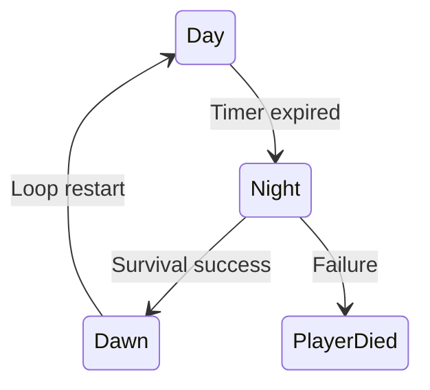

# /docs/ux-context.md — Midnight Mall (Roblox-specific UX Context)

> **Purpose:** Single source of truth for Claude/Cursor to keep visuals, motion, and interaction patterns consistent across stories. **All stories must reference this file.**

---

## 🧭 0) How to Use
- Always import `/docs/ux-context.md` before generating any UI or story scripts.  
- Reference tokens and modules directly (e.g., `LightingPresets.Night`).  
- Never hardcode RGB values, fonts, or tween durations.  
- Validate visual states against the **Definition of Done** at the end of this file.  
- Link this file and `/docs/sprint1_ux_refactor.md` when creating new UX stories or prefabs.

---

## 1) Visual Tone & Theme
- **Mood arc:** Calm blue **Day** → ominous red-tinted **Night** → cold, washed **Dawn** relief.
- **Aesthetic:** Cinematic survival; soft neon accents; minimal HUD.

---

## 2) Color & Lighting Tokens (Roblox)
Use these tokens, never hardcode values in stories. Access via `LightingPresets` module.

```lua
-- ReplicatedStorage/Shared/LightingPresets.lua
return {
  Day = {
    Ambient = Color3.fromRGB(180, 190, 210),
    OutdoorAmbient = Color3.fromRGB(180, 190, 210),
    FogColor = Color3.fromRGB(190, 210, 230),
    FogStart = 80,
    FogEnd = 800,
    ColorShift_Top = Color3.fromRGB(180, 190, 210),
    ColorShift_Bottom = Color3.fromRGB(160, 170, 190),
    Brightness = 2.0,
    ExposureCompensation = 0,
  },
  Night = {
    Ambient = Color3.fromRGB(25, 20, 30),
    OutdoorAmbient = Color3.fromRGB(25, 20, 30),
    FogColor = Color3.fromRGB(120, 20, 20),
    FogStart = 40,
    FogEnd = 260,
    ColorShift_Top = Color3.fromRGB(120, 110, 140),
    ColorShift_Bottom = Color3.fromRGB(80, 70, 90),
    Brightness = 1.3,
    ExposureCompensation = -0.35,
  },
  Dawn = {
    Ambient = Color3.fromRGB(120, 130, 160),
    OutdoorAmbient = Color3.fromRGB(120, 130, 160),
    FogColor = Color3.fromRGB(170, 180, 200),
    FogStart = 60,
    FogEnd = 600,
    ColorShift_Top = Color3.fromRGB(150, 160, 180),
    ColorShift_Bottom = Color3.fromRGB(120, 130, 160),
    Brightness = 1.8,
    ExposureCompensation = -0.1,
  }
}
```

**Lighting transition durations**:
- `TRANSITION_SHORT = 0.3` — UI banners  
- `TRANSITION_MED = 1.0` — HUD fades  
- `TRANSITION_LONG = 1.5` — Day↔Night scene change

---

## 3) Typography & UI Scale
- **Fonts:** `Font_Primary = GothamSemibold`, `Font_Body = Gotham`, `Font_Mono = Code`
- **Sizes:** `FS_SM = 14`, `FS_MD = 18`, `FS_LG = 24`, `FS_XL = 32`
- **Mobile-safe:** UIScale bound to `min(viewport.x, viewport.y)`  
- Maintain 24 px tap targets and consistent line height

---

## 4) Layout & Composition
- **Grid base:** 8 px spacing unit  
- **HUD Safe Zones:** 32 px margin from edges  
- **Layer order (z-index):**
  1. 3D World  
  2. HUD elements  
  3. Banners & alerts  
  4. Pause & menu overlays  
- **Anchor examples:**
  - `HUD_Root` — bottom-left icons, top-right timer  
  - `UI_Banner` — full-width, top layer  
  - `UI_Panel` — 8 px padding, vertical layout  

---

## 5) Motion Tokens (TweenService)
- **Easing:** `Enum.EasingStyle.Quad`, `Enum.EasingDirection.InOut`
- **Durations:**  
  - `TWEEN_UI = 0.3`  
  - `TWEEN_FEEDBACK = 0.15`  
  - `TWEEN_SCENE = 1.5`
- **Rules:** Never animate opacity and position on separate timings.

---

## 6) UI Components & Naming
Use prefab components; do not invent new ones.
- `UI_ButtonPrimary` — rounded 8 px, padding 12/16, shadow level 2  
- `UI_Banner` — full-width top banner for state changes  
- `UI_IconPrimary` — 32×32 container, label below (FS_SM), 4 px gap  
- `UI_Panel` — 8 px padding, shadow level 1  
- `HUD_Root` — anchors icons bottom-left, timer top-right  

---

## 7) Audio Tokens
- `SFX_NightStart` (-6 dB)  
- `SFX_LootOpen` (-10 dB)  
- `SFX_BoardPlace` (-8 dB)  
- `SFX_EnemyHit` (-8 dB)  
- **Heartbeat loop:** starts at `NightStart`, volume ramps 0 → 0.4 over 3 s  

---

## 8) Camera Tokens
- Third-person, `FOV = 70`  
- Shoulder offset `(X=1.5, Y=1.2, Z=0)`  
- Transition with `TWEEN_SCENE`  

---

## 9) Accessibility
- Minimum text contrast 4.5:1  
- Subtitles toggle for dialogue/audio cues  
- Colorblind-safe palette for banners  
- **Motion-sensitive mode:** use fade-only transitions  

---

## 10) Interaction Templates
- **Loot Open:** `E` press → 0.15 s lid nudge → puff particle → `SFX_LootOpen` → HUD count increments +0.15 s count-up  
- **Barricade Place:** ghost green/red → confirm → 0.2 s snap + `SFX_BoardPlace`  
- **Night Start:** `UI_Banner` slide 0.3 s + fade 1.0 s; heartbeat fade-in 3 s; apply `LightingPresets.Night` over 1.5 s  

---

## 11) Signals & Data (Authoritative Names)
- `Signals.DayStarted`, `Signals.NightStarted`, `Signals.InventoryChanged`, `Signals.PlayerDied`
- `Inventory.lua` API → `GetCount(player, itemId)`, `Add(player, itemId, amount)`
- `Currency.lua` API → `GetCoins(player)`, `AddCoins(player, n)`

---

## 12) UX Flow (State Diagram)


---

## 13) Visual Reference (Core Palette)

| Phase | Key Color | Accent | Fog | Emotion |
|-------|------------|--------|-----|----------|
| Day   | `#B4BED2` | `#6EA6FF` | `#BECFE6` | Calm, hopeful |
| Night | `#19141E` | `#781414` | `#78728A` | Threat, fear |
| Dawn  | `#7882A0` | `#B0B4C8` | `#AAB4C0` | Relief, renewal |

---

## 14) UX Feedback Rules
- Combine **sound + motion + light** for all critical events.  
- Avoid simultaneous overlapping SFX in one category (e.g., limit to 1 UI click sound).  
- Use gentle camera shake only for hits or nearby explosions.  
- Flash intensity < 0.2 seconds for accessibility compliance.  

---

## 15) Mobile vs. Desktop
- Maintain same FOV; reflow HUD when width < 720 px.  
- Hide non-essential panels on portrait.  
- Buttons expand to min width 64 px; icon labels wrap automatically.  

---

## 16) Definition of Done (Visual)
- Verified on PC 1080p and mobile portrait  
- All colors and motion pull from tokens; no ad-hoc timings  
- Follows accessibility and layout rules above  
- Visual parity confirmed for Day/Night/Dawn scenes  

---

## 🧠 17) Claude Code Reference Mode
When generating UX scripts or verifying builds:
- Load `/docs/ux-context.md` and `/docs/sprint1_ux_refactor.md`.  
- Use canonical token names exactly as written.  
- Check that interactions align with `Interaction Templates`.  
- Apply motion constants from **Motion Tokens** and verify completion via `Definition of Done`.

---

